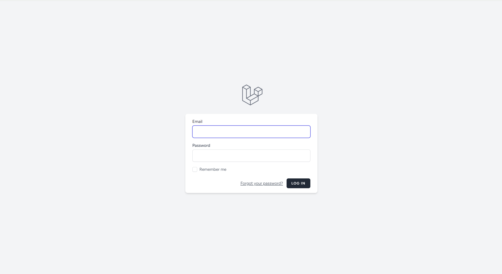
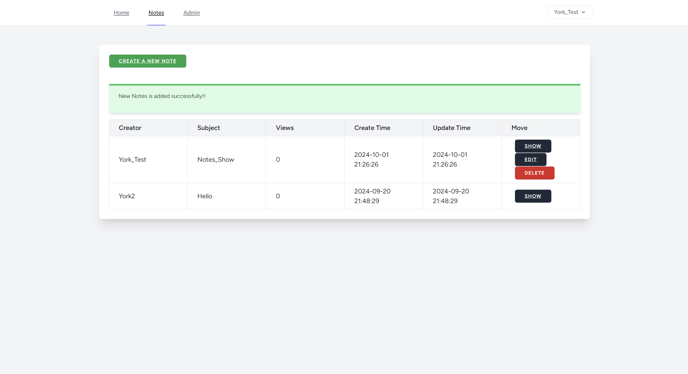
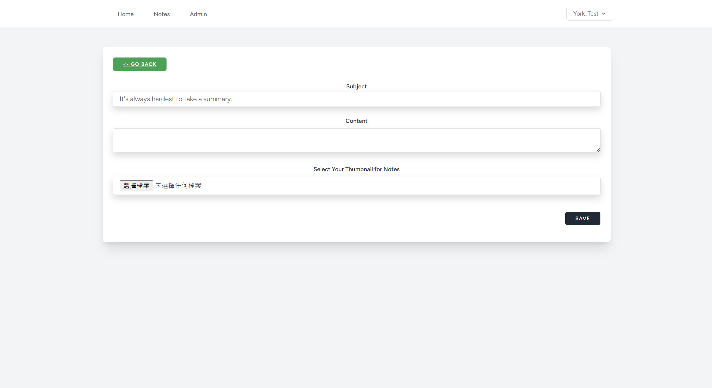
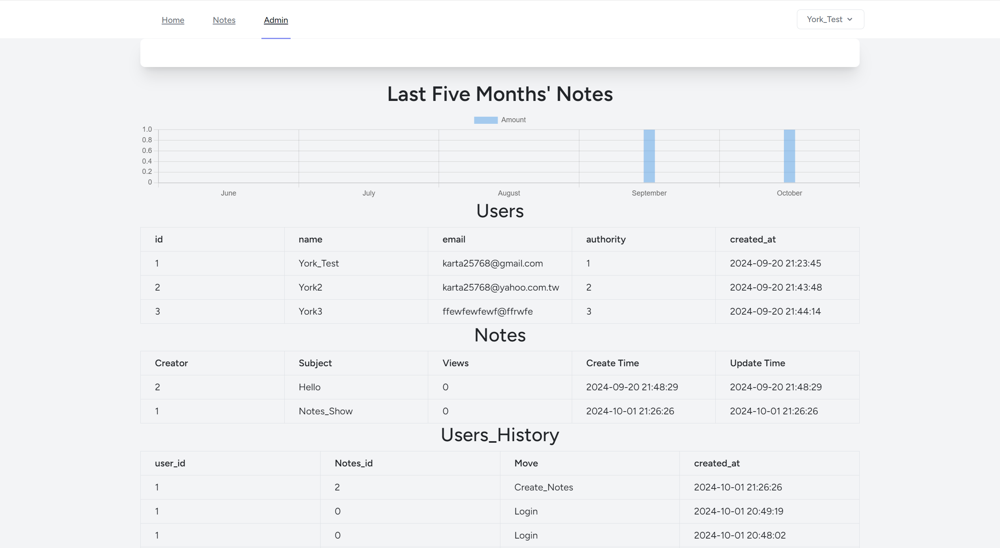

<h1>About Online-Notes Framework_V2.0</h1>
<h1>What's new in Version2.0</h1>
<h2>More convenient</h2>
Using package from Laravel - Sanctum, now you can login with your Google account without registering!
<h2>More safety</h2>
The login page is tested with common SQL magic commands.
So it's no worry that somebody using illegal password to create Notes or go to Admin page to steal user's info.

If you want to see the picture of testing for SQL Injection, you can go to https://github.com/Yorkxe/Online-Notes/Framwork_V2.0/README_IMAGE/SQL_Injection.
The url in Online-Notes is tested with Postman.
So it's no necessary that others would edit/delete your hard works, or furthermore go into Admin page to steal all users' info.
All test images from postman are in https://github.com/Yorkxe/Online-Notes/Framwork_V2.0/README_IMAGE/Postman_Test.

This is my personal side-project about personal note system.
And it's running on the AMP(Apache、MySQL、PHP), looks similar with the last Online-Notes.
But this time it's using the most popular framework for PHP - Laravel!!
The advantage about using framework is listed below.
1. more easily to maintain and update the content.
2. tons of downloadable opensource
3. similiar format from others' project

If you want to learn more about Online-Notes, go to the link below
https://github.com/Yorkxe/Online-Notes/blob/main/README.md.

<h1>
    Before Starting
</h1>

---
Before starting, you should do the following steps.
1. Download Xampp、PHP、Composer、Node.js, the step is also including in https://github.com/Yorkxe/Online-Notes/blob/main/README.md.
2. Download the zip file for Online-Notes Framework_V1.0.
3. Unzip the Online-Notes Framework_V1.0 to "C:\xampp\htdocs".
4. Open the Xampp panel, and start the Apache、MYSQL.
5. Open the CMD, cd to "C:\xampp\htdocs\Online-Notes-Framework_V1.0".
6. Add a new database、a new user for Online-Notes.
7. Editing the .nev file in Online-Notes Framework_V1.0, edit the DB_CONNECTION、DB_DATABASE、DB_USERNAME、DBPASSWORD.
8. Type the below command in CMD
* composer install
* composer update
* npm install
* npm update
* npm run build
* php artisan key:generate
* php artisan optimize:clear
* php artisan migrate
* php artisan serve
9. Type www.Online-Notes.com.tw in your browser Chrome、Edge、FireFox etc.
10. Finally you have your own website for creating your personal Notes!!

<h1>Feature</h1>

---
<h2>Straightforward UI</h2>

<strong>Login</strong>

<strong>Notes_list</strong>

<strong>Create_Notes</strong>

There are 3 levels of authority.
* 1: Admin - Authority to watch the data for all users、Notes、users_History、Notes_History.
* 2: User_Advanced: Authority to create、edit、delete Notes.
* 3: User_General: Authority to only read Notes.
With the authority system, it's needlessly to worry your own Notes edited or deleted by others.

<strong>Admin-mode</strong>

With the Admin authority, you can manage all the users' data and watch the trend for users' and Notes' History.

On the top is the Last Five Month's Notes, it uses the chart.js to show this data - https://www.chartjs.org/.
With this you can understand which month is the most versatile for creating knowledge.